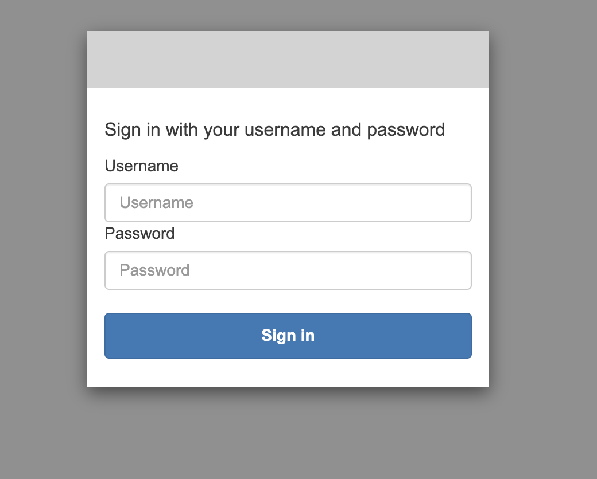

<!---- Provide an overview of what is being achieved in this repo ---->
# HDCRS School 2025

This repository includes contents for the Third and Fourth day of the HDCRS School: [Using Terramind FM](/Terramind/), and [Using Prithvi EO](/Prithvi-EO/).

Each day have their own set of notebooks. They are tuned to run in an AWS Sagemaker environment. If you want to run these in any other environments, you can refer to the [HDCRS School 2025 materials](https://github.com/NASA-IMPACT/HDCRS-school-2025/)

# Slides

# Prerequisites

1. Basic understanding of git
2. Python and jupyter environment knowledge
3. Basic understanding of docker
4. Basic understanding of cloud services
5. Machine Learning knowledge
6. Some understanding of Geo-spatial datasets.

# Getting started

1. Navigate to [Login URL](https://workshop-domain-1etw46yx.auth.us-west-2.amazoncognito.com/login?client_id=5vh3l4mekphu1oqj8s87au2s1a&response_type=code&scope=aws.cognito.signin.user.admin+openid+profile&redirect_uri=https://w9zxxt2d4a.execute-api.us-west-2.amazonaws.com/invoke)
2. Log in using the credential provided

3. Once the Studio starts, Click on JupyterLab


4. <code style="color : red">A JupyterLab space should already be availble for you. If not, please follow along the next steps. Skip to Step 9 if the environment is already available.</code>
5. Click `Create JupyterLab Space`

6. Give it a name. Eg: `Workshop`
7. Once initialized, change Instance type to `ml.t3.2xlarge` and storage to `150`
8. Click on `Run Space`. If it throws an error, you might have to pick an Image. The top setting called `Latest` works.
9. If a space is already running, click on "open". This should open a new tab with the jupyterlab environment.


# Environment setup

The following steps are to be followed if the `HDCRS-school-2025` folder is not available in your jupyterlab environment. If it is already available skip to 2.

1. Clone this repository `git clone https://github.com/nasa-impact/HDCRS-school-2025.git`

```
a. Click `git`
b. Click on `Git Clone Repo`

c. Paste `https://github.com/nasa-impact/HDCRS-school-2025.git` and Click on `Clone`.


```

2. Check conda environments

a. Open a terminal

b. Activate conda environment using `source /opt/conda/bin/activate`

c. List conda environments `conda env list`

d. Activate `prithvi_eo` environment: `conda activate prithvi_eo`

e. Open python terminal: `python`

f. Import torch: `import torch`

<code style="color : red">Run the following only if there are issues with the conda environments</code>

If there are any issues with the environments, conda environments might need to be removed and reinstalled via the terminal:

```
conda activate base
conda remove -n prithvi_eo --all -y
conda remove -n terramind --all -y

source /home/sagemaker/HDCRS-school-2025/setup/setup.sh
```

[Please check the environment once the environments are set.](#environment-setup)

**Notebooks are available for each day which can be ran in the sagemaker environment.**
